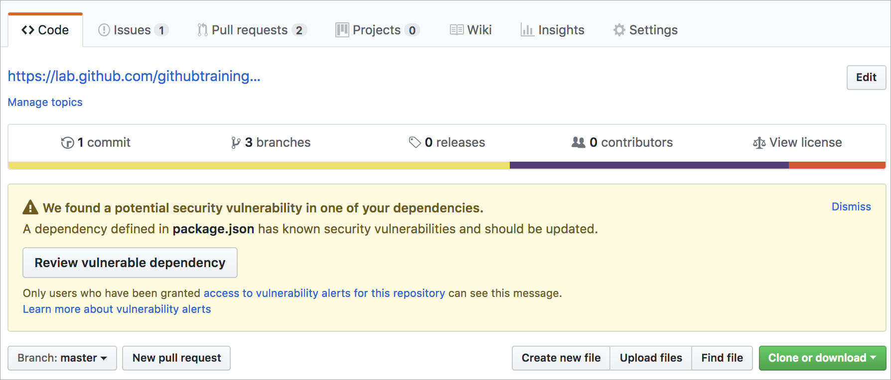

Here, we'll discuss some ways you can automate security checks in a repository that are available to GitHub repository administrators.

## Detect and fix outdated dependencies with security vulnerabilities

Virtually every project these days takes dependencies on external packages. While these components can offer substantial benefits in productivity, they can introduce other security risks. Staying on top of these packages and their vulnerability status can be time consuming, especially given how each dependency may have its own dependencies that can become difficult to track and maintain. Fortunately, GitHub provides features that reduce this workload.

### Repository dependency graphs

One default feature every repository enjoys is dependency graphs. GitHub scans common package manifests, such as `package.json`, `requirements.txt`, and others. These graphs allow project owners to recursively track all of the dependencies their project relies on.

For the list of supported dependency manifests, see [Listing the packages that a repository depends on](https://help.github.com/github/visualizing-repository-data-with-graphs/listing-the-packages-that-a-repository-depends-on#supported-languages?azure-portal=true).

### Automated dependency alerts

Even with a visual dependency graph, it can still be overwhelming to stay on top of the latest security considerations for every dependency a project has. To reduce this overhead, GitHub provides [automated dependency alerts](https://docs.github.com/en/code-security/supply-chain-security/managing-vulnerabilities-in-your-projects-dependencies/about-alerts-for-vulnerable-dependencies#dependabot-alerts-for-vulnerable-dependencies) that watch your dependency graphs for you. It then cross-references target versions with versions on known vulnerability lists. When a risk is discovered, the project is alerted. Input for the analysis comes from [GitHub Security Advisories](https://docs.github.com/en/code-security/security-advisories/about-github-security-advisories#dependabot-alerts-for-published-security-advisories).

### Automated dependency updates with Dependabot

Most of the time, a dependency alert leads to a project contributor bumping the offending package reference to the recommended version and creating a pull request for validation. Wouldn't it be great if there was a way to automate this effort? Well, good news! That's exactly what **Dependabot** does. It scans for dependency alerts and creates pull requests so that a contributor can validate the update and merge the request.

To learn more about Dependabot's flexibility, see [Configuring GitHub Dependabot security updates](https://help.github.com/github/managing-security-vulnerabilities/configuring-github-dependabot-security-updates?azure-portal=true).

### Automated code scanning

Similar to how Dependabot scans your repository for dependency alerts, you can use code scanning to analyze and find security vulnerabilities and errors in the code in a GitHub repository. Code scanning has several benefits; you can use it to find, triage, and prioritize fixes for existing problems or potential security vulnerabilities. It's also useful to help prevent developers from introducing any new security problems into the code.

Another advantage to code scanning is its ability to use CodeQL. CodeQL lets you query code as data, which lats you create custom queries or use queries maintained by the open-source community. Code scanning gives you the freedom to customize and maintain how the code within your repository is being scanned.

You can enable code-scanning alerts and workflows in the security tab of a GitHub repository:

:::image type="content" source="../media/security-overview.png" alt-text="A list of policies, advisories, and alerts with links to more information.":::

Learn more about [Code scanning and CodeQL](https://docs.github.com/en/free-pro-team@latest/github/finding-security-vulnerabilities-and-errors-in-your-code/about-code-scanning#about-code-scanning).

### Secret scanning

Another automated scanning feature within a GitHub repository is secret scanning. Similar to the previous security scanning features, secret scanning looks for known secrets or credentials committed within the repository. This scanning is done to prevent the use of fraudulent behavior and to secure the integrity of any sensitive data. By default, secret scanning occurs on public repositories and can be enabled on private repositories by repository administrators or organization owners.

When secret scanning detects a set of credentials, GitHub notifies the service provider who issued the secret. The service provider validates the credential, then decides whether they should revoke the secret, issue a new secret, or reach out to you directly, which will depend on the associated risks to you or the service provider.

Learn more about [Secret scanning for public and private repositories](https://docs.github.com/en/free-pro-team@latest/github/administering-a-repository/about-secret-scanning).
